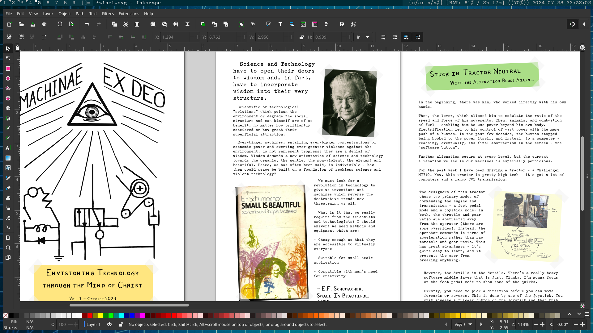

# zinescape
tools for making zines with inkscape

# requirements
- pdfbook2 
- ghostscript

# zinescape template

this command makes a blank zine template for inkscape. options:

- n=<number of pages,>
- w=<width of page, inches>
- h=<height of page, inches>
- s=<spacing between pages, inches>
- m=<page margin, inches>

# zinescape compile

this command takes a .pdf file you've saved from inkscape and arranges it into a zine format. also does image compression. autogenerates output filenames. requires argument:

- n=<number of pages per fold; aka "signature"> (if you don't know what this means, just put in the number of pages in the pdf. must be a multiple of 4)

# notes
doesn't support metric (yet?)
only does single fold flip on long edge
